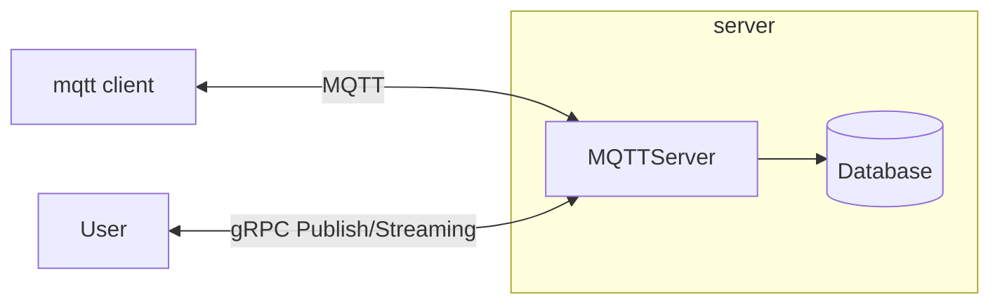

> [!WARNING]
> 🚧 This repository is for understanding the handling of MQTT and tokio, and experimental. It is a work in progress.

## architecture



- The user can communicate with the server via gRPC and publish packets to the devices.

- The user can receive packets published by the devices through gRPC server streaming via the server.

- Pub/Sub communication between devices and the server via MQTT.

- The server utilizes tokio's green threads to concurrently handle communication with multiple devices.

- I am currently only implementing QoS0 / MQTTv3.1

## build
```
cargo build
```

## Payload Storage
If you specify the address of Cassandra, you can save the latest published payload to Cassandra.

## option
```

USAGE:
    mqtt-server [FLAGS] [OPTIONS]

FLAGS:
    -h, --help          Prints help information
    -n, --non-broker    server start in a mode where communication with clients occurs exclusively via gRPC, not through
                        an MQTT broker, and direct communication between clients is not possible.
    -V, --version       Prints version information

OPTIONS:
    -a, --addr <IPADDR>                 server's address consist of port [default: 127.0.0.1:8883]
    -d, --db_addr <CASSANDRA IPADDR>    This is the port for Cassandra used to store the latest topics. If not
                                        specified, Cassandra will not be used. [default: ]
    -c, --cert <FILEPATH>               server cert @ pem format [default: server.crt]
    -k, --key <FILEPATH>                server key @ pem format [default: private.key]
```

